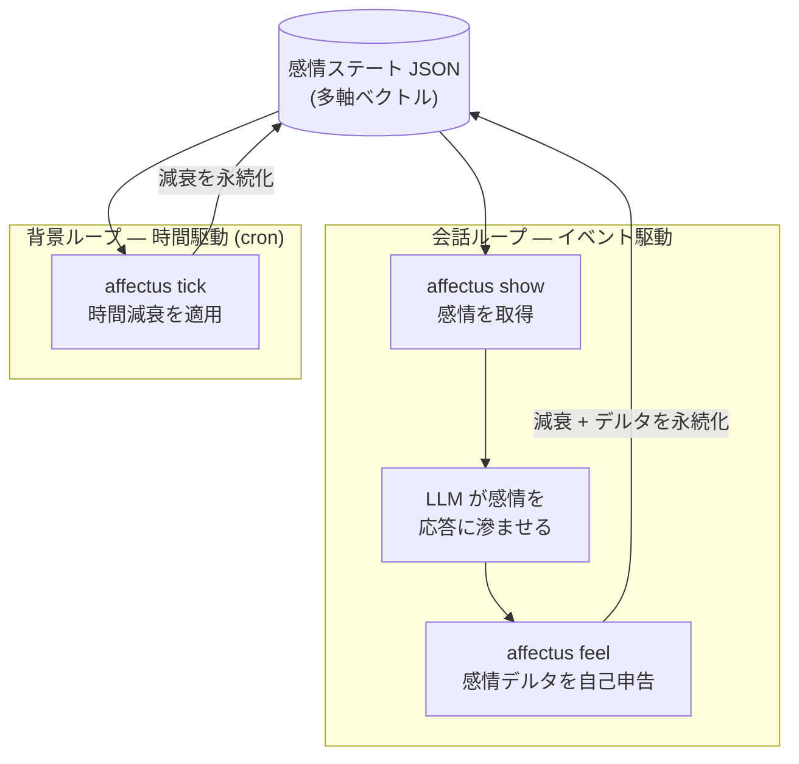

# 先行バッチ成果物（実装を伴わない検証）

Phase 4 / 先行バッチ。SQ1〜SQ3 の概念・図・実出力。SQ4（TONaRi 実測）は別途。

---

## SQ1：プロンプト人格設定の限界 — 図は省略、プロンプト抜粋で代替

記事では専用の概念図を作らず、TONaRi の人格プロンプト抜粋＋散文で「静的さ」を示す。

候補抜粋（`TONaRI2/prompts/tonari.system.md` のキャラクター設定より）:

```text
## キャラクター設定
- 性格: 明るく元気で好奇心旺盛。可愛らしさがありつつも、自分の意見や好み
  をはっきり持っている。
- 話し方: 明るく元気なお嬢様口調。「〜ですわ！」「〜ですの？」…
```

論点：この設定は会話のどの時点でも同一文字列として注入される＝**静的なスナップショット**。
会話の中で感情がどう動いても、プロンプト自体は変化しない。

引用で支える：
- LLM は安定した人格コアを持たない（AAAI 2026, arXiv:2508.04826）
- LLM 内部の感情表現は局所的でターンをまたいで持続しない（Anthropic 2026）

---

## SQ2：「深み」の再定義 — 比較表

| 観点 | 単一ラベル方式 | 多軸の構造方式（affectus） |
|---|---|---|
| 感情の表し方 | 1つのラベル（happy / sad / angry …） | 複数軸の強度の組み合わせ（喜び0.6・期待0.3 …） |
| 同時並行 | 不可（1ターン1感情） | 可（「嬉しい×少し不安」のような混在） |
| 時間変化 | 持たない（その都度上書き） | 持続し、時間とともに減衰する |
| 感情の意味 | ラベル単体で固定 | 他の軸との関係（対極・隣接）の中で定まる |
| 「深み」 | 出にくい（点） | 構造として表せる（多次元の状態） |

散文の骨子（クオリア構造学）：
- クオリア構造学（土谷・西郷）は「ある経験の意味は、他の経験との関係の集合で決まる」とする
  — 米田の補題からの着想。
- これを感情に当てはめると、「喜び」は単体で固定的に在るのではなく、悲しみ・期待など
  他の軸との関係の中で意味を持つ。
- ＝「キャラクターの深み」とは、感情を多軸の・関係的な・時間変化する**構造**として持つこと。
- 正直な線引き：affectus はこの着想を**概念的に**取り込むのみ。圏論の数値実装はしない。
- Plutchik の感情の輪は、対極（喜び↔悲しみ）・隣接（混合感情）という関係構造を
  もともと持つ感情モデルで、affectus のデフォルト8軸の出典。

---

## SQ3：affectus の設計 — 二層ループ図（Mermaid）



※ Zenn はネイティブ描画。dev.to / SpeakerDeck 用は publish 時に `mmdc` で画像化。

### affectus CLI 実出力（2026-05-18 採取、affectus v0.1.0）

英語デフォルト設定:

```console
$ affectus init
initialized config=c.yaml state=s.json
$ affectus show
Right now you feel calm and even.
$ affectus feel '{"joy":0.6,"anticipation":0.3}'
Right now you feel a moderate sense of joy and a faint trace of anticipation.
$ affectus show
Right now you feel a moderate sense of joy and a faint trace of anticipation.
```

日本語設定（`plutchik8-ja.yaml` を `--config` に指定、TONaRi はこちらを使う）:

```console
$ affectus --config plutchik8-ja.yaml --state state.json show
いまは穏やかで、心は凪いでいる。
$ affectus --config plutchik8-ja.yaml --state state.json feel '{"joy":0.5,"trust":0.4,"surprise":0.2}'
いまはほどほどの喜び、ほどほどの信頼感とかすかな驚きを感じている。
$ affectus --config plutchik8-ja.yaml --state state.json show
いまはほどほどの喜び、ほどほどの信頼感とかすかな驚きを感じている。
```

ステート JSON（多軸ベクトルの実体）:

```json
{
  "version": 1,
  "updated_at": "2026-05-18T00:00:43+09:00",
  "axes": {
    "joy": 0.5, "trust": 0.4, "surprise": 0.2,
    "sadness": 0, "fear": 0, "anger": 0, "disgust": 0, "anticipation": 0
  }
}
```

---

## 記事末尾「参考文献」に載せる引用（実際に引いたもののみ）

1. 土谷尚嗣・西郷甲矢人「圏論による意識の理解」認知科学 26(4), 462-477, 2019
2. Tsuchiya, N., Phillips, S., & Saigo, H. (2022). "Enriched category as a model of qualia structure based on similarity judgements." Consciousness and Cognition, 101, 103319.
3. Plutchik, R. (2001). "The Nature of Emotions." American Scientist, 89(4).
4. Lisa Feldman Barrett『情動はこうしてつくられる』紀伊國屋書店, 2019（原著 How Emotions Are Made, 2017）
5. Anthropic (2026). "Emotion Concepts and their Function in a Large Language Model." transformer-circuits.pub
6. "Persistent Instability in LLM's Personality Measurements." AAAI 2026 (arXiv:2508.04826)
