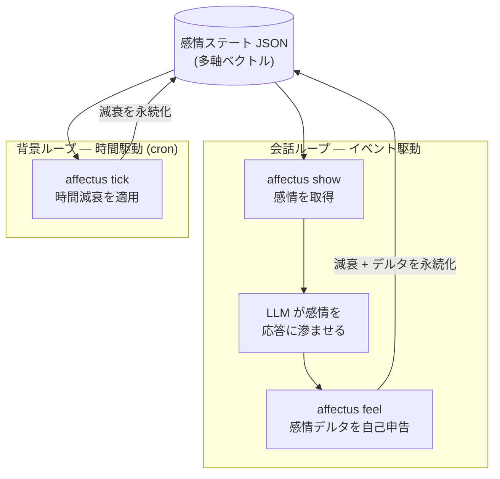

# 動的な感情制御はAIエージェントとの会話を深くするか

## TL;DR

AIキャラクターの「深み」は、プロンプトを盛り込むことでは作れない。本記事は「深み」を感情の多軸的な構造として捉え直し、それをプロンプトの外に持たせる設計（OSSライブラリ `affectus`）を示す。さらに、その効果を個人AIエージェントで検証する計画と評価方法を述べる。

> 本記事は検証フェーズが進行中のベース版です。導入前後の実測結果（「検証」セクション）は後日追記します。

## 対象読者と背景

対象は、AIエージェントや自前のAIキャラクターを作っている／作ろうとしている人。

プロンプトでキャラクターを作り込んでも、会話を続けるうちに応答が表面的に感じられることがある。「もっと深みがほしい」と思っても、その「深み」が何なのかは言葉にしづらい。本記事はこの「深み」を定義し直し、プロンプトに依らない感情制御の設計とその検証方法を示す。

## なぜプロンプトによる人格設定だけでは足りないのか

AIキャラクターの人格は、多くの場合システムプロンプトで与える。たとえば筆者の個人エージェント「TONaRi」の人格プロンプトはこうなっている。

```text
## キャラクター設定
- 性格: 明るく元気で好奇心旺盛。可愛らしさがありつつも、自分の意見や好み
  をはっきり持っている。
- 話し方: 明るく元気なお嬢様口調。「〜ですわ！」「〜ですの？」…
```

このプロンプトは、会話のどの時点でも同じ文字列として注入される。つまり人格は静的なスナップショットであり、会話の経過に応じて変化しない。

一方で、研究はLLM自体の不安定さも示している。LLMは人間のような安定した人格コアを持たず、文脈によって振る舞いが揺らぐ（AAAI 2026）。またLLM内部の感情表現は局所的で、ターンをまたいで持続しないことが報告されている（Anthropic 2026）。

結果として、長い会話ほど「設定どおりに演じている」感じが表面化する。会話の中で動く感情を保持する仕組みが、プロンプトの外に必要になる。

## 「キャラクターの深み」とは何か

「深み」を設計するには、まずそれが何かを決める必要がある。ここでは感情の表し方を2つ比べる。

| 観点 | 単一ラベル方式 | 多軸の構造方式 |
|---|---|---|
| 感情の表し方 | 1つのラベル（happy / sad …） | 複数軸の強度の組み合わせ |
| 同時並行 | 不可（1ターン1感情） | 可（「嬉しい×少し不安」） |
| 時間変化 | 持たない（その都度上書き） | 持続し、時間とともに減衰する |
| 感情の意味 | ラベル単体で固定 | 他の軸との関係で定まる |

着想元にしたのは「クオリア構造」の考え方だ。土谷・西郷らの研究は、ある経験の意味はそれ単体でなく、他の経験との関係の集合によって決まるとする（米田の補題からの着想）。これを感情に当てはめると、「喜び」は単体で固定的に在るのではなく、悲しみや期待など他の感情との関係の中で意味を持つ。

つまり「キャラクターの深み」とは、感情を多軸の・関係的な・時間変化する構造として持つことだと整理できる。単一ラベルが「点」なら、構造方式は「多次元の状態」である。

感情の輪で知られるPlutchikのモデルは、対極（喜び↔悲しみ）や隣接（混合感情）といった関係をはじめから持つ。後述の `affectus` はこれをデフォルトの8軸に採用している。

なお本記事は、クオリア構造の考え方を概念的な着想として用いる。圏論による数式的な実装は行わない。

## affectus の設計：感情を外部の構造として持つ

`affectus` は、この「感情の構造」をLLMの外部に持たせるOSSライブラリである（[github.com/n-yokomachi/affectus](https://github.com/n-yokomachi/affectus)）。感情を多軸ベクトルのJSONとして保持し、2つのループで更新する。



- **会話ループ（イベント駆動）**：エージェントはターンの最初に `affectus show` で現在の感情を自然言語で受け取り、応答に滲ませる。ターンの最後に `affectus feel` で感情の変化（デルタ）を自己申告する。
- **背景ループ（時間駆動）**：cron で `affectus tick` を定期実行し、時間減衰だけを適用する。会話していない間も感情が自然に薄れていく。

重要なのは、`affectus` が感情分類モデルを持たないことだ。感情がどう動いたかを判断するのはLLM自身であり、ライブラリは算術と永続化だけを担う決定論的なコンポーネントである。

実際のCLIはこう動く（日本語設定の例）。

```console
$ affectus show
いまは穏やかで、心は凪いでいる。
$ affectus feel '{"joy":0.5,"trust":0.4,"surprise":0.2}'
いまはほどほどの喜び、ほどほどの信頼感とかすかな驚きを感じている。
```

感情の状態は、次のようなJSONとして持続する。

```json
{
  "axes": {
    "joy": 0.5, "trust": 0.4, "surprise": 0.2,
    "sadness": 0, "fear": 0, "anger": 0, "disgust": 0, "anticipation": 0
  }
}
```

## 検証：TONaRi で導入前後を比べる（検証中）

設計が会話を実際に変えるかを、筆者の個人AIエージェント「TONaRi」で検証する。

- **方法**：TONaRi に `affectus` を統合し、3つの会話シナリオ（強いポジティブ／強いネガティブ／中立）を、導入前（baseline）と導入後で同じ入力により実行する。各シナリオは固定した8〜12ターン。
- **客観指標**：両条件の応答を AWS Comprehend の感情分析（`DetectSentiment`、日本語）にかけ、ターンごとの感情極性スコアを baseline と比較する。主観的な読みに頼らず、機械的な指標でも差が出るかを見る。
- **仮説**：劇的な変化は予想していない。効果が表れるとすれば、感情の振れ幅が大きい局面で口調や絵文字の有無として現れる程度だと考える。テキストはそもそも感情表現としては低帯域なチャネルであり、テキスト単独で十分な効果を得るのは難しい。

検証結果（感情極性スコアの推移、導入前後の応答比較）は、後日この節に追記する。

## まとめ

キャラクターの「深み」は、プロンプトを盛り込むことではなく、持続し変化する感情の「構造」として設計できる。`affectus` はそれをプロンプトの外に切り出す一つの実装である。

ただし、その構造をユーザーに届けるチャネル（テキストか音声か）が、効果の見え方を左右する。テキストという狭いチャネルでは、効果は限定的に見えるかもしれない。この点は導入前後の検証で確かめ、追記する。

## 参考文献

1. 土谷尚嗣・西郷甲矢人「圏論による意識の理解」認知科学 26(4), 462-477, 2019
2. Tsuchiya, N., Phillips, S., & Saigo, H. (2022). "Enriched category as a model of qualia structure based on similarity judgements." *Consciousness and Cognition*, 101, 103319.
3. Plutchik, R. (2001). "The Nature of Emotions." *American Scientist*, 89(4).
4. Anthropic (2026). "Emotion Concepts and their Function in a Large Language Model." transformer-circuits.pub
5. "Persistent Instability in LLM's Personality Measurements." AAAI 2026 (arXiv:2508.04826)
